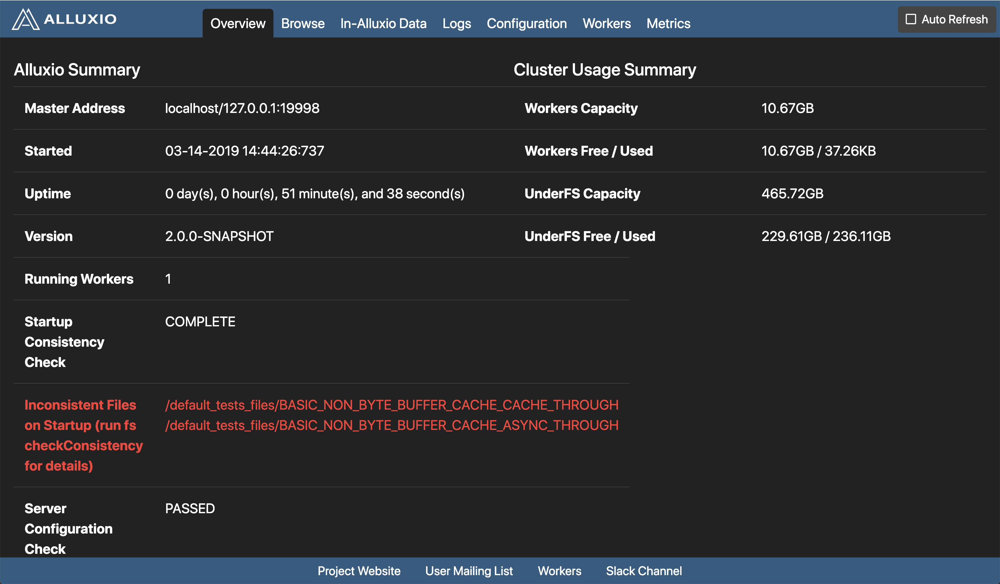
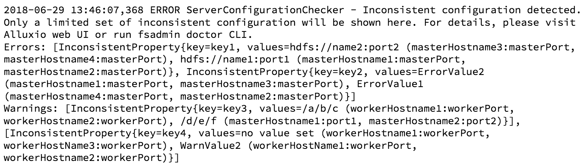

# Configuration Settings

An Alluxio cluster can be configured by setting the values of Alluxio
[configuration properties](../reference/Properties-List.md) within
`${ALLUXIO_HOME}/conf/alluxio-site.properties`.

The two major components to configure are:
- [Alluxio servers](#configure-an-alluxio-cluster), consisting of Alluxio processes such as masters and workers
- [Alluxio clients](#configure-applications), which are typically a part of compute applications

Alluxio properties mostly fall into three categories:

- properties prefixed with `alluxio.user` affect Alluxio client operations (e.g. compute applications)
- properties prefixed with `alluxio.master` affect the Alluxio master processes
- properties prefixed with `alluxio.worker` affect the Alluxio worker processes

## Configure Applications

Customizing how an application interacts with Alluxio is specific to each application.
The following are recommendations for some common applications.

### Alluxio Shell Commands

Alluxio shell users can put JVM system properties `-Dproperty=value` after the `fs` command and
before the subcommand to specify Alluxio user properties from the command line.
For example, the following Alluxio shell command sets the write type to `CACHE_THROUGH` when copying
files to Alluxio:

```console
$ ./bin/alluxio fs -Dalluxio.user.file.writetype.default=CACHE_THROUGH \
  copyFromLocal README.md /README.md
```

Note that, as a part of Alluxio deployment, the Alluxio shell will also take the configuration in
`${ALLUXIO_HOME}/conf/alluxio-site.properties` when it is run from Alluxio installation at
`${ALLUXIO_HOME}`.

### Spark

To customize Alluxio client-side properties in Spark applications,
Spark users can use pass Alluxio properties as JVM system properties.
See examples for
[configuring the Spark service](../compute/Spark.md#basic-setup)
or for
[individual Spark jobs](../compute/Spark.md#customize-alluxio-user-properties-for-individual-spark-jobs).

### Hadoop MapReduce

See examples to configure Alluxio properties for
[the MapReduce service](../compute/Hadoop-MapReduce.md#customize-alluxio-user-properties-for-all-mapreduce-jobs)
or for
[individual MapReduce jobs](../compute/Hadoop-MapReduce.md#customize-alluxio-user-properties-for-individual-mapreduce-jobs).

### Hive

Hive can be configured to use customized Alluxio client-side properties for the entire service.
See
[examples](../compute/Hive.md#customize-alluxio-user-properties).

### Presto

Presto can be configured to use customized Alluxio client-side properties for the entire service.
See
[examples](../compute/Presto.md#customize-alluxio-user-properties).

## Configure an Alluxio Cluster

### `alluxio-site.properties` Files (Recommended)

Alluxio admins can create and edit the properties file `conf/alluxio-site.properties` to
configure Alluxio masters or workers.
If this file does not exist, it can be copied from the template file under `${ALLUXIO_HOME}/conf`:

```console
$ cp conf/alluxio-site.properties.template conf/alluxio-site.properties
```

Make sure that this file is distributed to `${ALLUXIO_HOME}/conf` on every Alluxio master
and worker before starting the cluster.
Restarting Alluxio processes is the safest way to ensure any configuration updates are applied.

### Environment Variables

Alluxio supports defining a few frequently used configuration settings through environment
variables, including:

<table class="table table-striped">
<tbody><tr><th>Environment Variable</th><th>Description</th></tr>

  <tr>
    <td><code class="language-plaintext highlighter-rouge">ALLUXIO_CONF_DIR</code></td>
    <td>The path to the alluxio configuration directory. This defines the value for the property key <code class="language-plaintext highlighter-rouge">alluxio.conf.dir</code> which should never be set directly outside the environment variable.
</td>
  </tr>

  <tr>
    <td><code class="language-plaintext highlighter-rouge">ALLUXIO_LOGS_DIR</code></td>
    <td>The path to the directory that stores Alluxio server logs. This defines the value for the property key <code class="language-plaintext highlighter-rouge">alluxio.logs.dir</code> which should never be set directly outside the environment variable.
</td>
  </tr>

  <tr>
    <td><code class="language-plaintext highlighter-rouge">ALLUXIO_USER_LOGS_DIR</code></td>
    <td>The path to the directory that stores Alluxio user logs. This defines the value for the property key <code class="language-plaintext highlighter-rouge">alluxio.user.logs.dir</code> which should never be set directly outside the environment variable.
</td>
  </tr>

  <tr>
    <td><code class="language-plaintext highlighter-rouge">ALLUXIO_MASTER_HOSTNAME</code></td>
    <td>Hostname of the Alluxio master. Defaults to <code class="language-plaintext highlighter-rouge">localhost</code>.</td>
  </tr>

  <tr>
    <td><code class="language-plaintext highlighter-rouge">ALLUXIO_MASTER_MOUNT_TABLE_ROOT_UFS</code></td>
    <td>The under storage system address. Defaults to <code class="language-plaintext highlighter-rouge">${ALLUXIO_HOME}</code>/underFSStorage which is a local file system.
</td>
  </tr>

  <tr>
    <td><code class="language-plaintext highlighter-rouge">ALLUXIO_RAM_FOLDER</code></td>
    <td>The directory where a worker stores its in-memory data. Defaults to <code class="language-plaintext highlighter-rouge">/mnt/ramdisk</code>.</td>
  </tr>

  <tr>
    <td><code class="language-plaintext highlighter-rouge">ALLUXIO_LOGSERVER_HOSTNAME</code></td>
    <td>Hostname of the log server. Empty by default.</td>
  </tr>

  <tr>
    <td><code class="language-plaintext highlighter-rouge">ALLUXIO_LOGSERVER_PORT</code></td>
    <td>The port number of the log server. Defaults to <code class="language-plaintext highlighter-rouge">45600</code></td>
  </tr>

  <tr>
    <td><code class="language-plaintext highlighter-rouge">ALLUXIO_LOGSERVER_LOGS_DIR</code></td>
    <td>The path to the local directory where the Alluxio log server stores logs received from the Alluxio servers.
</td>
  </tr>

  <tr>
    <td><code class="language-plaintext highlighter-rouge">ALLUXIO_JAVA_OPTS</code></td>
    <td>Java VM options for the Alluxio master, worker, and shell commands. By default, <code class="language-plaintext highlighter-rouge">ALLUXIO_JAVA_OPTS</code> is prepended to other <code class="language-plaintext highlighter-rouge">ALLUXIO_*_JAVA_OPTS</code> environment variables, such as <code class="language-plaintext highlighter-rouge">ALLUXIO_MASTER_JAVA_OPTS</code> and <code class="language-plaintext highlighter-rouge">ALLUXIO_USER_JAVA_OPTS</code>.
</td>
  </tr>

  <tr>
    <td><code class="language-plaintext highlighter-rouge">ALLUXIO_MASTER_JAVA_OPTS</code></td>
    <td>Additional Java VM options for Alluxio master configuration.</td>
  </tr>

  <tr>
    <td><code class="language-plaintext highlighter-rouge">ALLUXIO_JOB_MASTER_JAVA_OPTS</code></td>
    <td>Additional Java VM options for Alluxio job master configuration.</td>
  </tr>

  <tr>
    <td><code class="language-plaintext highlighter-rouge">ALLUXIO_WORKER_JAVA_OPTS</code></td>
    <td>Additional Java VM options for Alluxio worker configuration.</td>
  </tr>

  <tr>
    <td><code class="language-plaintext highlighter-rouge">ALLUXIO_JOB_WORKER_JAVA_OPTS</code></td>
    <td>Additional Java VM options for Alluxio job worker configuration.</td>
  </tr>

  <tr>
    <td><code class="language-plaintext highlighter-rouge">ALLUXIO_PROXY_JAVA_OPTS</code></td>
    <td>Additional Java VM options for Alluxio proxy configuration.</td>
  </tr>

  <tr>
    <td><code class="language-plaintext highlighter-rouge">ALLUXIO_LOGSERVER_JAVA_OPTS</code></td>
    <td>Additional Java VM options for Alluxio log server configuration.</td>
  </tr>

  <tr>
    <td><code class="language-plaintext highlighter-rouge">ALLUXIO_USER_JAVA_OPTS</code></td>
    <td>Additional Java VM options for Alluxio shell command configuration.</td>
  </tr>

  <tr>
    <td><code class="language-plaintext highlighter-rouge">ALLUXIO_CLASSPATH</code></td>
    <td>Additional classpath entries for Alluxio processes. Empty by default.</td>
  </tr>

  <tr>
    <td><code class="language-plaintext highlighter-rouge">ALLUXIO_MASTER_ATTACH_OPTS</code></td>
    <td>Additional Java VM options to apply when attaching a debugger to Alluxio master.</td>
  </tr>

  <tr>
    <td><code class="language-plaintext highlighter-rouge">ALLUXIO_SECONDARY_MASTER_ATTACH_OPTS</code></td>
    <td>Additional Java VM options to apply when attaching a debugger to Alluxio secondary master.</td>
  </tr>

  <tr>
    <td><code class="language-plaintext highlighter-rouge">ALLUXIO_JOB_MASTER_ATTACH_OPTS</code></td>
    <td>Additional Java VM options to apply when attaching a debugger to Alluxio job master.</td>
  </tr>

  <tr>
    <td><code class="language-plaintext highlighter-rouge">ALLUXIO_WORKER_ATTACH_OPTS</code></td>
    <td>Additional Java VM options to apply when attaching a debugger to Alluxio worker.</td>
  </tr>

  <tr>
    <td><code class="language-plaintext highlighter-rouge">ALLUXIO_JOB_WORKER_ATTACH_OPTS</code></td>
    <td>Additional Java VM options to apply when attaching a debugger to Alluxio job worker.</td>
  </tr>

  <tr>
    <td><code class="language-plaintext highlighter-rouge">ALLUXIO_PROXY_ATTACH_OPTS</code></td>
    <td>Additional Java VM options to apply when attaching a debugger to Alluxio proxy.</td>
  </tr>

  <tr>
    <td><code class="language-plaintext highlighter-rouge">ALLUXIO_LOGSERVER_ATTACH_OPTS</code></td>
    <td>Additional Java VM options to apply when attaching a debugger to Alluxio log server.</td>
  </tr>

  <tr>
    <td><code class="language-plaintext highlighter-rouge">ALLUXIO_FUSE_ATTACH_OPTS</code></td>
    <td>Additional Java VM options to apply when attaching a debugger to Alluxio FUSE process.</td>
  </tr>

  <tr>
    <td><code class="language-plaintext highlighter-rouge">ALLUXIO_USER_ATTACH_OPTS</code></td>
    <td>Additional Java VM options to apply when attaching a debugger to Alluxio shell command.</td>
  </tr>

</tbody></table>

For example, the following example will set up:
- an Alluxio master at `localhost`
- the root mount point as an HDFS cluster with a namenode also running at `localhost`
- defines the maximum heap space of the VM to be 30g
- enable Java remote debugging at port 7001

```console
$ export ALLUXIO_MASTER_HOSTNAME="localhost"
$ export ALLUXIO_MASTER_MOUNT_TABLE_ROOT_UFS="hdfs://localhost:9000"
$ export ALLUXIO_MASTER_JAVA_OPTS="-Xmx30g"
$ export ALLUXIO_MASTER_ATTACH_OPTS="-agentlib:jdwp=transport=dt_socket,server=y,suspend=n,address=7001"
```

Users can either set these variables through the shell or in `conf/alluxio-env.sh`.
If this file does not exist yet, it can be copied from the template file under `${ALLUXIO_HOME}/conf`:

```console
$ cp conf/alluxio-env.sh.template conf/alluxio-env.sh
```

### Cluster Defaults

When different client applications (Alluxio Shell CLI, Spark jobs, MapReduce jobs)
or Alluxio workers connect to an Alluxio master, they will initialize their own Alluxio
configuration properties with the default values supplied by the masters based on the master-side
`${ALLUXIO_HOME}/conf/alluxio-site.properties` files.
As a result, cluster admins can set default client-side settings (e.g., `alluxio.user.*`), or
network transport settings (e.g., `alluxio.security.authentication.type`) in
`${ALLUXIO_HOME}/conf/alluxio-site.properties` on all the masters, which will be distributed and
become cluster-wide default values when clients and workers connect.

For example, the property `alluxio.user.file.writetype.default` defaults to `ASYNC_THROUGH`, which
first writes to Alluxio and then asynchronously writes to the UFS.
In an Alluxio cluster where data persistence is preferred and all jobs need to write to both the UFS
and Alluxio, the administrator can add `alluxio.user.file.writetype.default=CACHE_THROUGH` in each
master's `alluxio-site.properties` file.
After restarting the cluster, all jobs will automatically set `alluxio.user.file.writetype.default`
to `CACHE_THROUGH`.

Clients can ignore or overwrite the cluster-wide default values by following the approaches
described in [Configure Applications](#configure-applications) to overwrite the same properties.

### Path Defaults

Alluxio administrators can set default client-side configurations for specific
Alluxio filesystem paths.
Filesystem client operations have options which are derived from client side configuration
properties.
Only client-side configuration properties can be set as path defaults.

For example, the `createFile` operation has an option to specify write type.
By default, the write type is the value of the configuration key `alluxio.user.file.writetype.default`.
The administrator can set default value of `alluxio.user.file.write.type.default` to `MUST_CACHE`
for all paths with prefix `/tmp` by running:

```console
$ bin/alluxio fsadmin pathConf add --property alluxio.user.file.writetype.default=MUST_CACHE /tmp`
```

After executing this command any create operations on paths with prefix `/tmp` will use the
`MUST_CACHE` write type by default unless the application configuration overrides the cluster
defaults.

Path defaults will be automatically propagated to long-running clients if they are updated.
If the administrator updates path defaults using the following:

```console
$ bin/alluxio fsadmin pathConf add --property alluxio.user.file.writetype.default=THROUGH /tmp
```

All write operations that occur on a path with the prefix `/tmp` prefix will use
the `THROUGH` write type by default.

See [`fsadmin pathConf`](../operation/Admin-CLI.md#pathconf) on how to
show, add, update, and remove path defaults.

## Configuration Sources

Alluxio properties can be configured from multiple sources.
A property's final value is determined by the following priority list, from highest priority to lowest:

1. [JVM system properties (i.e., `-Dproperty=key`)](http://docs.oracle.com/javase/jndi/tutorial/beyond/env/source.html#SYS)
2. [Environment variables](#environment-variables)
3. [Property files](#alluxio-siteproperties-files--recommended-):
When an Alluxio cluster starts, each server process including master and worker searches for
`alluxio-site.properties` within the following directories in the given order, stopping when a match is found:
`${CLASSPATH}`, `${HOME}/.alluxio/`, `/etc/alluxio/`, and `${ALLUXIO_HOME}/conf`
4. [Path default values](#path-defaults)
5. [Cluster default values](#cluster-defaults):
An Alluxio client may initialize its configuration based on the cluster-wide default configuration served by the masters.

If no user-specified configuration is found for a property, Alluxio will fall back to
its [default property value](../reference/Properties-List.md).

To check the value of a specific configuration property and the source of its value,
users can run the following command:

```console
$ ./bin/alluxio getConf alluxio.worker.rpc.port
29998
$ ./bin/alluxio getConf --source alluxio.worker.rpc.port
DEFAULT
```

To list all of the configuration properties with sources:

```console
$ ./bin/alluxio getConf --source
alluxio.conf.dir=/Users/bob/alluxio/conf (SYSTEM_PROPERTY)
alluxio.debug=false (DEFAULT)
...
```

Users can also specify the `--master` option to list all
of the cluster-wide configuration properties served by the masters.
Note that with the `--master` option, `getConf` will query the
master which requires the master process to be running.
Otherwise, without `--master` option, this command only checks the local configuration.

```console
$ ./bin/alluxio getConf --master --source
alluxio.conf.dir=/Users/bob/alluxio/conf (SYSTEM_PROPERTY)
alluxio.debug=false (DEFAULT)
...
```

## Java 11 Configuration

Alluxio also supports Java 11.
To run Alluxio on Java 11, configure the `JAVA_HOME` environment variable to point to a Java 11
installation directory.
If you only want to use Java 11 for Alluxio, you can set the `JAVA_HOME` environment variable in
the `alluxio-env.sh` file.
Setting the `JAVA_HOME` in `alluxio-env.sh` will not affect the Java version which may be used
by other applications running in the same environment.

## Server Configuration Checker

The server-side configuration checker helps discover configuration errors and warnings.
Suspected configuration errors are reported through the web UI, `fsadmin doctor` CLI, and master logs.

The web UI shows the result of the server configuration check.

<figure><figcaption></figcaption></figure>

Users can also run the `fsadmin doctor` command to get the same results.

```console
$ ./bin/alluxio fsadmin doctor configuration
```

Configuration warnings can also be found in the master logs.

<figure><figcaption></figcaption></figure>
